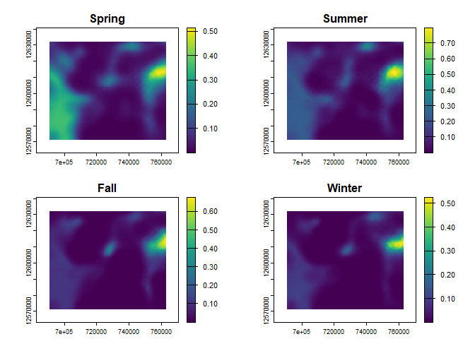

<!-- README.md is generated from README.Rmd. Please edit that file -->

# caribouMetrics

<!-- badges: start -->

[](https://github.com/LandSciTech/caribouMetrics/actions/workflows/R-CMD-check.yaml)
<!-- badges: end -->

The caribouMetrics R package provides reproducible and open source
implementations of several models of Boreal woodland caribou (*Rangifer
tarandus caribou*) demography and habitat use. These include a
population and demographic model that allows users to predict
demographic rates for a given level of disturbance and project
population growth over time. Demographic rates are predicted using model
coefficients published in [Johnson et.
al. (2020)](doi:10.1111/1365-2664.13637). Population growth is projected
using a two-stage demographic model with density dependence and
interannual variability based on Johnson et. al. (2020) but with some
modifications as described in [Dyson et
al. (2022)](https://doi.org/10.1101/2022.06.01.494350). In addition to
these national scale models, we provide a simple Bayesian integrated
population model that integrates prior information from national
analysis of demographic-disturbance relationships with available local
demographic data to reduce uncertainty in population viability
projections. Our model is an extension of work by [Eacker et
al. (2019)](https://doi.org/10.1002/wsb.950) with some modifications and
an added ability to simulate observation data given parameters that
define a common caribou monitoring program. Finally, caribouMetrics
contains a set of functions which implement the caribou resource
selection probability functions (RSPF) for Ontario boreal caribou ranges
described in [Hornseth and Rempel
(2016)](https://doi.org/10.1139/cjz-2015-0101).

## Installation

You can install the development version from
[GitHub](https://github.com/) with:

``` r
# install.packages("devtools")
devtools::install_github("LandSciTech/caribouMetrics")
```

## Example

This is a basic example demonstrating all the primary functions of the
package.

``` r
library(caribouMetrics)
#> The legacy packages maptools, rgdal, and rgeos, underpinning the sp package,
#> which was just loaded, will retire in October 2023.
#> Please refer to R-spatial evolution reports for details, especially
#> https://r-spatial.org/r/2023/05/15/evolution4.html.
#> It may be desirable to make the sf package available;
#> package maintainers should consider adding sf to Suggests:.
#> The sp package is now running under evolution status 2
#>      (status 2 uses the sf package in place of rgdal)

pthBase <- system.file("extdata", package = "caribouMetrics")

# load example data
landCoverD <- terra::rast(file.path(pthBase, "landCover.tif")) 
  # convert PLC classes to resource types used in the model 
landCoverD <- reclassPLC(landCoverD)
eskerDras <- terra::rast(file.path(pthBase, "eskerTif.tif"))
eskerDshp <- sf::read_sf(file.path(pthBase, "esker.shp"))
natDistD <- terra::rast(file.path(pthBase, "natDist.tif"))
anthroDistD <-terra::rast(file.path(pthBase, "anthroDist.tif"))
linFeatDras <- terra::rast(file.path(pthBase, "linFeatTif.tif"))
projectPolyD <- sf::read_sf(file.path(pthBase, "projectPoly.shp"))

# calculate disturbance 
disturb <- disturbanceMetrics(landCover = landCoverD,
                              linFeat = linFeatDras,  
                              natDist = natDistD,
                              projectPoly = projectPolyD)
#> cropping landCover to extent of projectPoly
#> cropping linFeat to extent of projectPoly
#> cropping natDist to extent of projectPoly
#> buffering anthropogenic disturbance
#> calculating disturbance metrics

disturb_tbl <- results(disturb)

# Calculate demographic rates
demCoefs <- demographicCoefficients(replicates = 10)

demRates <- demographicRates(covTable = disturb_tbl,
                             popGrowthPars = demCoefs)
#> popGrowthPars contains quantiles so they are used instead of the defaults
#> popGrowthPars contains quantiles so they are used instead of the defaults
demRates
#>   zone   Anthro     Fire Total_dist fire_excl_anthro FID     S_bar   S_stdErr
#> 1    1 39.86675 1.732936   40.45363        0.5868729   0 0.8479506 0.05405621
#>     S_PIlow  S_PIhigh     R_bar   R_stdErr    R_PIlow  R_PIhigh
#> 1 0.7487979 0.9302797 0.1816836 0.09490028 0.06382286 0.3828127

# Simulate population growth
popGrow <- caribouPopGrowth(N = 2000, numSteps = 20, R_bar = demRates$R_bar, 
                            S_bar = demRates$S_bar)

popGrow
#>     N0    lambda   N       R_t       S_t n_recruits surviving_adFemales
#> 1 2000 0.9200186 376 0.1803221 0.8396411         22                 354

# simulate caribou collar observations
params <- getScenarioDefaults(
  iAnthro = disturb_tbl$Anthro, iFire = disturb_tbl$Fire,
  collarCount = 30, cowMult = 3, 
  obsAnthroSlope = 0, projAnthroSlope = 1, projYears = 10, obsYears = 10
)
simObs <- simulateObservations(params, printPlot = TRUE)
```


``` r

ipm <- caribouBayesianIPM(simObs$simSurvObs, simObs$ageRatioOut, 
                          simObs$simDisturbance,
                          # only set to speed up vignette. Normally keep defaults.
                          Niter = 150, Nburn = 100)
#> using Kaplan-Meier survival model

natSim <- getSimsNational(Anthro = unique(simObs$simDisturbance$Anthro))
#> Warning: Setting expected survival S_bar to be between l_S and h_S.

ipmTbls <- getOutputTables(ipm, paramTable = simObs$paramTable, 
                            exData = simObs$exData, 
                            simNational = natSim)

plotRes(ipmTbls, c("Recruitment", "Adult female survival"))
#> $Recruitment
#> Warning: Removed 10 rows containing missing values (`geom_point()`).
```


    #> 
    #> $`Adult female survival`
    #> Warning: Removed 11 rows containing missing values (`geom_point()`).



``` r

# Calculate habitat use in Ontario's Churchill range
carHab1 <- caribouHabitat(
  landCover = landCoverD,
  esker = eskerDras, 
  natDist = natDistD, 
  anthroDist = anthroDistD, 
  linFeat = linFeatDras, 
  projectPoly = projectPolyD,
  caribouRange = "Churchill"
)
#> cropping landCover to extent of projectPoly
#> cropping linFeat to extent of projectPoly
#> cropping natDist to extent of projectPoly
#> cropping anthroDist to extent of projectPoly
#> cropping esker to extent of projectPoly
#> resampling linFeat to match landCover resolution
#> resampling esker to match landCover resolution
#> Applying moving window.

# plot the results
plot(carHab1)
```


## Resources

The [package website](https://landscitech.github.io/caribouMetrics)
contains information on the caribouMetrics package. Here you can find
[documentation for each
function](https://landscitech.github.io/caribouMetrics/reference/index.html)
and the following articles/vignettes/tutorials:

- [**Demographic
  Model**](https://landscitech.github.io/caribouMetrics/articles/caribouDemography.html):
  Predict demographic rates and population growth based on their
  relationship to habitat disturbance.
- [**Bayesian Demographic
  Projection**](https://landscitech.github.io/caribouMetrics/articles/BayesianDemographicProjection.html):
  Project demographic rates and population growth based on the national
  demographic model and local caribou observations.
- [**Disturbance
  Metrics**](https://landscitech.github.io/caribouMetrics/articles/Using_disturbanceMetrics.html):
  Calculate buffered anthropogenic disturbance and fire disturbance
  percentages for a given area.
- [**Ontario Habitat
  Model**](https://landscitech.github.io/caribouMetrics/articles/Using_caribouHabitat.html):
  Calculate caribou habitat use with Ontario RSF models.
- [**User Interface
  Help**](https://landscitech.github.io/caribouMetrics/articles/UI_help.html):
  Instructions for using the SyncroSim user interface for integrating
  SpaDES, LandR and FireSense projections with caribou habitat and
  demographic models (WIP)

## Getting help

If you have any questions about the caribouMetrics package or
suggestions for improving it, please [post an issue on the code
repository](https://github.com/LandSciTech/caribouMetrics/issues/new).

# References

Dyson, M., Endicott, S., Simpkins C., Turner, J.W., Avery-Gomm S.,
Johnson, C.A., Leblond, M., Neilson, E.W., Rempel, R., Wiebe, P.A.,
Baltzer, J.L., Stewart, F.E.C., Hughes, J. 2022. Existing caribou
habitat and demographic models are poorly suited for Ring of Fire impact
assessment: A roadmap for improving the usefulness, transparency, and
availability of models for conservation. bioRxiv 2022.06.01.494350;
<https://doi.org/10.1101/2022.06.01.494350>

Eacker, D.R., Hebblewhite, M., Steenweg, R., Russell, M., Flasko, A. and
Hervieux, D., 2019. Web‐based application for threatened woodland
caribou population modeling. Wildlife Society Bulletin, 43(1),
pp.167-177. <https://doi.org/10.1002/wsb.950>

ECCC. 2011. Scientific assessment to inform the identification of
critical habitat for woodland caribou (*Rangifer tarandus caribou*),
boreal population, in Canada. Canadian Wildlife Service, Ottawa.
<http://epe.lac-bac.gc.ca/100/200/301/environment_can/2011/scientific_assessment_inform-ef/CW66-296-2011-eng.pdf>.
Accessed 26 Mar 2021.

Hornseth, M.L. and Rempel, R.S., 2016. Seasonal resource selection of
woodland caribou (Rangifer tarandus caribou) across a gradient of
anthropogenic disturbance. Canadian Journal of Zoology, 94(2), pp.79-93.
<https://doi.org/10.1139/cjz-2015-0101>

Johnson, C.A., Sutherland, G.D., Neave, E., Leblond, M., Kirby, P.,
Superbie, C. and McLoughlin, P.D., 2020. Science to inform policy:
linking population dynamics to habitat for a threatened species in
Canada. Journal of Applied Ecology, 57(7), pp.1314-1327.
<https://besjournals.onlinelibrary.wiley.com/doi/full/10.1111/1365-2664.13637>

## License

caribouMetrics - Terms and Condition of Use

Unless otherwise noted, source code of the `caribouMetrics` R package is
covered under Crown Copyright, Government of Canada, and distributed
under the GPL3 license.

Copyright (C) Her Majesty the Queen in Right of Canada as represented by
the Minister of the Environment 2021/(C) Sa Majesté la Reine du chef du
Canada représentée par le ministre de l’Environnement 2021.
