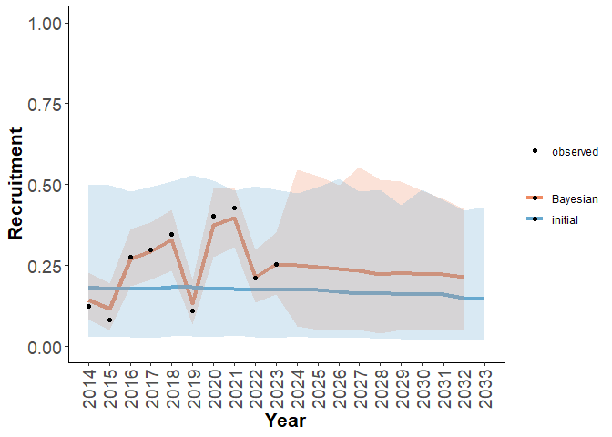

<!-- README.md is generated from README.Rmd. Please edit that file -->

# caribouMetrics

<!-- badges: start -->
<!-- badges: end -->

caribouMetrics provides implementations of several different models.
Firstly, it implements the caribou resource selection probability
functions described in Hornseth and Rempel (2016) *Seasonal resource
selection of woodland caribou (Rangifer tarandus caribou) across a
gradient of anthropogenic disturbance*. This allows for a spatial
prediction of caribou habitat use across 13 caribou ranges in Ontario.
The package also includes an implementation of the population and
demographic models in *Science to inform policy: linking population
dynamics to habitat for a threatened species in Canada* by Johnson et.
al. (2020) and the “Environment Canada Scientific Assessment to Inform
the Identification of Critical Habitat for Woodland Caribou (*Rangifer
tarandus caribou*), Boreal Population, in Canada 2011 Update” report.
These functions allow users to calculate metrics of disturbance, predict
demographic rates for a given level of disturbance and simulate
population growth over time.

## Installation

You can install the development version from
[GitHub](https://github.com/) with:

``` r
# install.packages("devtools")
devtools::install_github("LandSciTech/caribouMetrics")
```

## Example

This is a basic example which shows you how to use the main functions:

``` r
library(caribouMetrics)

pthBase <- system.file("extdata", package = "caribouMetrics")

# load example data
landCoverD <- raster::raster(file.path(pthBase, "landCover.tif")) 
  # convert PLC classes to resource types used in the model 
landCoverD <- reclassPLC(landCoverD)
eskerDras <- raster::raster(file.path(pthBase, "eskerTif.tif"))
eskerDshp <- sf::read_sf(file.path(pthBase, "esker.shp"))
natDistD <- raster::raster(file.path(pthBase, "natDist.tif"))
anthroDistD <-raster::raster(file.path(pthBase, "anthroDist.tif"))
linFeatDras <- raster::raster(file.path(pthBase, "linFeatTif.tif"))
projectPolyD <- sf::read_sf(file.path(pthBase, "projectPoly.shp"))

# Calculate habitat use
carHab1 <- caribouHabitat(
  landCover = landCoverD,
  esker = eskerDras, 
  natDist = natDistD, 
  anthroDist = anthroDistD, 
  linFeat = linFeatDras, 
  projectPoly = projectPolyD,
  caribouRange = "Churchill"
)
#> cropping landCover to extent of projectPoly
#> cropping natDist to extent of projectPoly
#> cropping anthroDist to extent of projectPoly
#> cropping esker to extent of projectPoly
#> cropping linFeat to extent of projectPoly
#> resampling linFeat to match landCover resolution
#> resampling esker to match landCover resolution
#> Applying moving window.

# plot the results
plot(carHab1)
```



``` r
# calculate disturbance 
disturb <- disturbanceMetrics(landCover = landCoverD,
                              linFeat = linFeatDras,  
                              natDist = natDistD,
                              projectPoly = projectPolyD)
#> cropping landCover to extent of projectPoly
#> cropping natDist to extent of projectPoly
#> cropping linFeat to extent of projectPoly
#> buffering anthropogenic disturbance
#> calculating disturbance metrics

results(disturb)
#>   zone   Anthro     Fire Total_dist fire_excl_anthro FID
#> 1    1 39.97933 1.734581   40.56555        0.5862182   0

# Calculate demographic rates
demCoefs <- demographicCoefficients(replicates = 10)

demRates <- demographicRates(covTable = results(disturb),
                             popGrowthPars = demCoefs)
#> Elapsed time for caribou prediction for femaleSurvival for Johnson:: 0.03 sec elapsed
#> Elapsed time for caribou prediction for recruitment for Johnson:: 0.01 sec elapsed
demRates
#>   zone   Anthro     Fire Total_dist fire_excl_anthro FID     S_bar   S_stdErr
#> 1    1 39.97933 1.734581   40.56555        0.5862182   0 0.8403108 0.04680671
#>     S_PIlow  S_PIhigh     R_bar  R_stdErr    R_PIlow  R_PIhigh
#> 1 0.7796476 0.8927702 0.1813372 0.1363773 0.09102343 0.5044036

# Simulate population growth
popGrow <- popGrowthJohnson(N = 2000, numSteps = 20, R_bar = demRates$R_bar, 
                            S_bar = demRates$S_bar)
#> [1] "projecting step  1"
#> [1] "projecting step  2"
#> [1] "projecting step  3"
#> [1] "projecting step  4"
#> [1] "projecting step  5"
#> [1] "projecting step  6"
#> [1] "projecting step  7"
#> [1] "projecting step  8"
#> [1] "projecting step  9"
#> [1] "projecting step  10"
#> [1] "projecting step  11"
#> [1] "projecting step  12"
#> [1] "projecting step  13"
#> [1] "projecting step  14"
#> [1] "projecting step  15"
#> [1] "projecting step  16"
#> [1] "projecting step  17"
#> [1] "projecting step  18"
#> [1] "projecting step  19"
#> [1] "projecting step  20"

popGrow
#>     N    lambda
#> 1 369 0.9191211
```

More detailed examples are provided in the vignettes.

# References

ECCC. 2011. Scientific assessment to inform the identification of
critical habitat for woodland caribou (*Rangifer tarandus caribou*),
boreal population, in Canada. Canadian Wildlife Service, Ottawa.
<http://epe.lac-bac.gc.ca/100/200/301/environment_can/2011/scientific_assessment_inform-ef/CW66-296-2011-eng.pdf>.
Accessed 26 Mar 2021.

Johnson, C.A., Sutherland, G.D., Neave, E., Leblond, M., Kirby, P.,
Superbie, C. and McLoughlin, P.D., 2020. Science to inform policy:
linking population dynamics to habitat for a threatened species in
Canada. Journal of Applied Ecology, 57(7), pp.1314-1327.
<https://besjournals.onlinelibrary.wiley.com/doi/full/10.1111/1365-2664.13637>

Hornseth, M.L. and Rempel, R.S., 2016. Seasonal resource selection of
woodland caribou (Rangifer tarandus caribou) across a gradient of
anthropogenic disturbance. Canadian Journal of Zoology, 94(2), pp.79-93.
<https://doi.org/10.1139/cjz-2015-0101>
