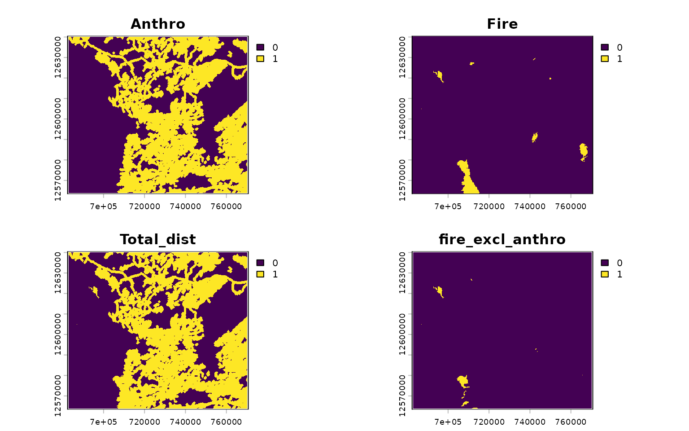

# Disturbance Metrics

``` r
library(caribouMetrics)
#> Loading required package: nimble
#> nimble version 1.4.1 is loaded.
#> For more information on NIMBLE and a User Manual,
#> please visit https://R-nimble.org.
#> 
#> Attaching package: 'nimble'
#> The following object is masked from 'package:stats':
#> 
#>     simulate
#> The following object is masked from 'package:base':
#> 
#>     declare
#> Loading required package: bbouNationalPriors
#> Loading required package: dplyr
#> 
#> Attaching package: 'dplyr'
#> The following objects are masked from 'package:stats':
#> 
#>     filter, lag
#> The following objects are masked from 'package:base':
#> 
#>     intersect, setdiff, setequal, union
library(dplyr)
library(terra)
#> terra 1.8.93
#> 
#> Attaching package: 'terra'
#> The following objects are masked from 'package:nimble':
#> 
#>     values, values<-
library(sf)
#> Linking to GEOS 3.12.1, GDAL 3.8.4, PROJ 9.4.0; sf_use_s2() is TRUE
library(ggplot2)
library(tidyr)
#> 
#> Attaching package: 'tidyr'
#> The following object is masked from 'package:terra':
#> 
#>     extract
theme_set(theme_bw())
pthBase <- system.file("extdata", package = "caribouMetrics")
```

## `disturbanceMetrics()`

The
[`disturbanceMetrics()`](https://landscitech.github.io/caribouMetrics/dev/reference/disturbanceMetrics.md)
function is used to calculate the metrics described in Table 52 of
Environment Canada Scientific Assessment to Inform the Identification of
Critical Habitat for Woodland Caribou (*Rangifer tarandus caribou*),
Boreal Population, in Canada 2011 Update. The metrics included are: \*
Fire: % non-overlapping fire \* Anthro: % non-overlapping anthropogenic
disturbance \* Total_dist: % total non-overlapping fire and
anthropogenic disturbance \* fire_excl_anthro: % fire not overlapping
with anthropogenic disturbance

[`disturbanceMetrics()`](https://landscitech.github.io/caribouMetrics/dev/reference/disturbanceMetrics.md)
uses several spatial data layers to calculate the percentage disturbance
in an area:

| Name (Argument)                        | Description                                                                                                         |
|----------------------------------------|---------------------------------------------------------------------------------------------------------------------|
| Land cover (landCover)                 | A raster where 0 and NA values are assumed to be water and are omitted from the total area, defines the raster grid |
| Linear features (linFeat)              | a raster, sf object, or list of these identifying the location of linear features (e.g. roads, rail)                |
| Natural disturbance (natDist)          | Cumulative natural disturbance (mostly fire) over the past 40 years                                                 |
| Anthropogenic disturbance (anthroDist) | Cumulative anthropogenic disturbance over the past 40 years                                                         |
| Project polygon (projPoly)             | An sf object containing polygon(s) of the study area(s)                                                             |

The example data set loaded below includes a small area in the Nipigon
caribou range that we will use as an example. Disturbance data sets can
be converted from polygons of year of disturbance or time since
disturbance using (`reclassDist`). In the example below fire data with
polygons containing year of disturbance are converted to a presence
absence raster of cumulative disturbance over the past 40 years.

``` r
# load example data and classify cumulative natural disturbance
landCoverD = rast(file.path(pthBase, "landCover.tif")) 
natDistD <- sf::st_read(file.path(pthBase, "fireAFFES2020.shp")) %>% 
  reclassDist(endYr = 2020, numCumYrs = 40, template = landCoverD, 
              dateField = "FIRE_YEAR")


anthroDistD = rast(file.path(pthBase, "anthroDist.tif"))
linFeatDras = rast(file.path(pthBase, "linFeatTif.tif"))
projectPolyD = st_read(file.path(pthBase, "projectPoly.shp"), quiet = TRUE)
linFeatDshp = st_read(file.path(pthBase, "roads.shp"), quiet = TRUE)
roadsD = st_read(file.path(pthBase, "roads.shp"), quiet = TRUE)
railD = st_read(file.path(pthBase, "rail.shp"), quiet = TRUE)
utilitiesD = st_read(file.path(pthBase, "utilities.shp"), quiet = TRUE)
```

`disturbanceMetrics` will prepare the data and then calculate
disturbance metrics used as predictor variables by Johnson et
al. (2020). The function can be run in several different ways, and the
simplest is to provide spatial objects for each input.

``` r
disturbance <- disturbanceMetrics(
  landCover=!is.na(landCoverD),
  natDist = natDistD,
  anthroDist = anthroDistD,
  linFeat = linFeatDras,
  projectPoly = projectPolyD
)
```

The `disturbanceMetrics` function returns an S4 object with the class
`DisturbanceMetrics`. To access a data.frame with one column per metric
use the `results` function.

``` r
str(disturbance, max.level = 2, give.attr = FALSE)
#> Formal class 'DisturbanceMetrics' [package "caribouMetrics"] with 8 slots
#>   ..@ landCover         :S4 class 'SpatRaster' [package "terra"]
#>   ..@ natDist           :S4 class 'SpatRaster' [package "terra"]
#>   ..@ anthroDist        :S4 class 'SpatRaster' [package "terra"]
#>   ..@ linFeat           :List of 1
#>   ..@ projectPoly       :Classes 'sf' and 'data.frame':  1 obs. of  2 variables:
#>   ..@ processedData     :S4 class 'SpatRaster' [package "terra"]
#>   ..@ disturbanceMetrics:'data.frame':   1 obs. of  6 variables:
#>   ..@ attributes        :List of 3
results(disturbance)
#>   zone   Anthro     Fire Total_dist fire_excl_anthro FID
#> 1    1 46.74151 1.726477   47.29954        0.5580347   0
```

``` r
plot(disturbance@processedData)
```


Multiple linear feature inputs can also be provided in vector form. See
`vignette("caribouHabitat", package = "caribouMetrics")` for other data
processing and input options.

``` r
disturbanceV <- disturbanceMetrics(
  landCover=!is.na(landCoverD),
  natDist = natDistD,
  anthroDist = anthroDistD,
  linFeat = list(roads = roadsD, rail = railD, utilities = utilitiesD),
  projectPoly = projectPolyD
)
```

``` r
plot(disturbanceV@processedData)
```


