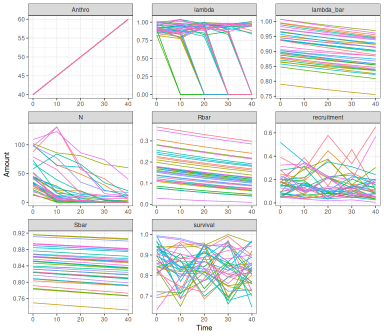

# Caribou Demographic Rates and Trajectories

## 1 Demographic rates and trajectories from the national model

### 1.1 Overview

Here we describe a demographic model with density dependence and
interannual variability following Johnson et al.
([2020](#ref-johnson2020)) with modifications noted in Hughes et al.
([2025](#ref-hughes2025)) and [Dyson et
al. (2022)](https://doi.org/10.1101/2022.06.01.494350). Demographic
rates vary with disturbance as estimated by Johnson et al.
([2020](#ref-johnson2020)). A detailed description of the model is
provided in ([Hughes et al. 2025, sec. 2.4](#ref-hughes2025)).

[`getNationalCoefficients()`](https://landscitech.github.io/caribouMetrics/dev/reference/getNationalCoefficients.md)
selects the regression coefficient values and standard errors for the
desired model version (see `popGrowthTableJohnsonECCC` for options) and
then samples coefficients from these Gaussian distributions for each
replicate population.

Next
[`estimateNationalRates()`](https://landscitech.github.io/caribouMetrics/dev/reference/estimateNationalRates.md)
is used to apply the sampled coefficients to the disturbance covariates
to calculate expected recruitment and survival according to the beta
regression models estimated by Johnson et al.
([2020](#ref-johnson2020)). Each population is optionally assigned to
quantiles of the Beta error distributions for survival and recruitment.
Using quantiles means that the population will stay in these quantiles
as disturbance changes over time, so there is persistent variation in
recruitment and survival among example populations.

Finally, we can use the estimated demographic rates to project
population dynamics using a simple model with two age classes.
Interannual variation in survival and recruitment is modelled using
truncated Beta distributions.

``` r
library(caribouMetrics)
# use local version on local and installed on GH
if (requireNamespace("devtools", quietly = TRUE)) devtools::load_all()
library(dplyr)
library(ggplot2)
library(tidyr)
library(patchwork)

theme_set(theme_bw())
pthBase <- system.file("extdata", package = "caribouMetrics")

figWidth <- 8; figHeight <- 10
```

### 1.2 Demographic outcomes in a simple case no variation in disturbance over time or among populations

A simple case for demographic projection is multiple stochastic
projections from a single landscape that does not change over time.
First we define a disturbance scenario with 40% anthropogenic
disturbance and 2% fire disturbance. If we had spatial data for the
disturbance in our area of interest we could use
[`disturbanceMetrics()`](https://landscitech.github.io/caribouMetrics/dev/reference/disturbanceMetrics.md)
to directly calculate the disturbance. (See [Disturbance
Metrics](https://landscitech.github.io/caribouMetrics/articles/Using_disturbanceMetrics.html)
vignette for an example).

``` r
disturbance <- data.frame(Anthro = 40, fire_excl_anthro = 2)
```

We begin by sampling coefficients for 500 replicate populations using
default Johnson et al. (2020) models “M1” and “M4”. The returned object
is a list containing the coefficients and standard errors from the
national model as well as the sampled coefficients and the quantiles
that they have been assigned to.

``` r
popGrowthPars <- getNationalCoefficients(500)

head(popGrowthPars$coefSamples_Survival$coefSamples)
#>       Intercept        Anthro Precision
#> [1,] -0.1530718 -0.0008907556  60.65168
#> [2,] -0.1399809 -0.0007155384  61.65165
#> [3,] -0.1612743 -0.0007628660  68.57570
#> [4,] -0.1420441 -0.0007747503  52.81483
#> [5,] -0.1370847 -0.0009535161  52.68192
#> [6,] -0.1329182 -0.0008050787  60.32032
head(popGrowthPars$coefSamples_Survival$coefValues)
#>    Intercept Anthro Precision
#>        <num>  <num>     <num>
#> 1:    -0.142 -8e-04  63.43724
head(popGrowthPars$coefSamples_Survival$coefStdErrs)
#>      Intercept      Anthro Precision
#>          <num>       <num>     <num>
#> 1: 0.007908163 0.000127551  8.272731
head(popGrowthPars$coefSamples_Survival$quantiles)
#> [1] 0.25345691 0.02880762 0.89123246 0.36007014 0.55806613 0.19063126
```

Next we calculate sample demographic rates given sampled model
coefficients and disturbance metrics for our example landscape, setting
`returnSample = TRUE` so that the results returned contain a row for
each sample in each scenario. We set the initial population size for
each sample population to 100, and project population dynamics for 20
years using the `caribouPopGrowth` function with default parameter
values. Anthropogenic disturbance is high on this example landscape, so
the projected population growth rate for most sample populations is
below 1, but there is variability in the model so few sample populations
persist.

``` r
rateSamples <- estimateNationalRates(
  covTable = disturbance,
  popGrowthPars = popGrowthPars,
  ignorePrecision = FALSE,
  returnSample = TRUE,
  useQuantiles = FALSE)     
rateSamples$N0 <- 100
demography <- cbind(rateSamples,
                    caribouPopGrowth(N = rateSamples$N0,
                                     numSteps = 20,
                                     R_bar = rateSamples$R_bar,
                                     S_bar = rateSamples$S_bar))
```

![Variation in demographic rates and outcomes among 500 sample
populations after a 20 year projection. Anthropogenic disturbance is
40%, fire disturbance is 2%. 'lambda' is realized population growth rate
in the final year, and 'lambdaE' is expected population growth rate
without interannual variation, density dependence or demographic
stochasticity. 'N' is the number of adult females, which includes new
recruits 'n_recruits' and survivors 'surviving_adFemales' from the
previous year. 'R_bar/S_bar' are the expected recruitment (calf:cow
ratio) and survival rates, 'R_t/S_t' are the recruitment and survival
rates in the final year, which are more variable because they include
interannual variation. 'X_t' is the recruitment rate adjusted for sex
ratio and (optionally) composition survey bias - see Hughes et al.
(2025) for
details.](caribouDemography_files/figure-html/plotSimpleDemography-1.png)

Figure 1.1: Variation in demographic rates and outcomes among 500 sample
populations after a 20 year projection. Anthropogenic disturbance is
40%, fire disturbance is 2%. ‘lambda’ is realized population growth rate
in the final year, and ‘lambdaE’ is expected population growth rate
without interannual variation, density dependence or demographic
stochasticity. ‘N’ is the number of adult females, which includes new
recruits ‘n_recruits’ and survivors ‘surviving_adFemales’ from the
previous year. ‘R_bar/S_bar’ are the expected recruitment (calf:cow
ratio) and survival rates, ‘R_t/S_t’ are the recruitment and survival
rates in the final year, which are more variable because they include
interannual variation. ‘X_t’ is the recruitment rate adjusted for sex
ratio and (optionally) composition survey bias - see Hughes et
al. (2025) for details.

TO DO: Use consistent labels for outcomes throughout

TO DO: show and explain outcome if no N0 provided.

### 1.3 Expected recruitment and survival: effects of disturbance and variation among populations

We can project demographic rates over a range of landscape conditions to
recreate figures 3 and 5 from Johnson et al. ([Johnson et al.
2020](#ref-johnson2020)) and see the effects of changing disturbance on
expected recruitment and survival. First we create a table of
disturbance scenarios across a range of different levels of fire and
anthropogenic disturbance.

``` r
covTableSim <- expand.grid(Anthro = seq(0, 90, by = 2), 
                           fire_excl_anthro = seq(0, 70, by = 10)) 
covTableSim$Total_dist = covTableSim$Anthro + covTableSim$fire_excl_anthro
```

We again sample coefficients from default models M1 and M4. The sample
of 500 is used to calculate averages, while the sample of 35 is used to
show variability among populations.

``` r
# set seed so vignette looks the same each time
set.seed(34533)

popGrowthPars <- getNationalCoefficients(
  500,
  modelVersion = "Johnson",
  survivalModelNumber = "M1",
  recruitmentModelNumber = "M4",
  populationGrowthTable = popGrowthTableJohnsonECCC
)

popGrowthParsSmall <- getNationalCoefficients(
  35,
  modelVersion = "Johnson",
  survivalModelNumber = "M1",
  recruitmentModelNumber = "M4",
  populationGrowthTable = popGrowthTableJohnsonECCC
)
```

Next we calculate expected survival and recruitment rates given sampled
model coefficients. For the smaller sample we set `returnSample = TRUE`
so that the results returned contain a row for each sample in each
scenario. Setting `useQuantiles = TRUE` assigns each sample population
to a quantile of the regression model error distributions for survival
and recruitment, allowing variation among populations to persist as
disturbance changes. For the larger sample we set `returnSample = FALSE`
to get summaries of mean and variation across the samples.

Johnson et al’s ([2020](#ref-johnson2020)) Beta regression models
estimate uncertainty about intercept and slope coefficients, and a
precision parameter that describes variation among observations
([Ferrari and Cribari-Neto 2004](#ref-ferrari2004)). To show the
importance of considering both these sources of variation we compare
results with `ignorePrecision = TRUE` and `ignorePrecision = FALSE`. If
the goal is to estimate and visualize nationally applicable
demographic-disturbance relationships then the precision parameter may
not be of interest (Figure [1.2](#fig:parameterUncertaintyOnly)). If we
are interested in the distribution of variation across the country it is
essential to include both uncertainty about the regression coefficients
and additional variation summarized by the precision parameter of the
Beta regression model (Figure [1.3](#fig:withPrecision)).

``` r
rateSamples <- estimateNationalRates(
  covTable = covTableSim,
  popGrowthPars = popGrowthParsSmall,
  ignorePrecision = FALSE,
  returnSample = TRUE,
  useQuantiles = TRUE
)

rateSummaries <- estimateNationalRates(
  covTable = covTableSim,
  popGrowthPars = popGrowthPars,
  ignorePrecision = FALSE,
  returnSample = FALSE,
  useQuantiles = FALSE
)

rateSummariesIgnorePrecision <- estimateNationalRates(
  covTable = covTableSim,
  popGrowthPars = popGrowthPars,
  ignorePrecision = TRUE,
  returnSample = FALSE,
  useQuantiles = FALSE
)
```

![Variation in expected survival and recruitment with disturbance. Bands
(2.5% and 97.5% quantiles of 500 samples) show variation due to
uncertainty about intercept and slope coefficients in Johnson et al's
\[-@johnson2020\] Beta regression
models.](caribouDemography_files/figure-html/parameterUncertaintyOnly-1.png)

Figure 1.2: Variation in expected survival and recruitment with
disturbance. Bands (2.5% and 97.5% quantiles of 500 samples) show
variation due to uncertainty about intercept and slope coefficients in
Johnson et al’s ([2020](#ref-johnson2020)) Beta regression models.

![Variation in expected survival and recruitment with disturbance. Bands
(2.5% and 97.5% quantiles of 500 samples) include both uncertainty about
the regression coefficients and additional variation summarized by the
precision parameter of Johnson et al's \[-@johnson2020\] Beta regression
models. Faint coloured lines show example trajectories of expected
demographic rates in sample populations, assuming each sample population
is randomly distributed among quantiles of the beta distribution, and
each population remains in the same quantile of the Beta distribution as
disturbance
changes.](caribouDemography_files/figure-html/withPrecision-1.png)

Figure 1.3: Variation in expected survival and recruitment with
disturbance. Bands (2.5% and 97.5% quantiles of 500 samples) include
both uncertainty about the regression coefficients and additional
variation summarized by the precision parameter of Johnson et al’s
([2020](#ref-johnson2020)) Beta regression models. Faint coloured lines
show example trajectories of expected demographic rates in sample
populations, assuming each sample population is randomly distributed
among quantiles of the beta distribution, and each population remains in
the same quantile of the Beta distribution as disturbance changes.

### 1.4 Projection of population growth over time on a changing landscape: workflow details

In this example, we project 35 sample populations for 50 years on a
landscape where the anthropogenic disturbance footprint is increasing by
5% per decade (Figure [1.4](#fig:changeOverTime)).

``` r
numTimesteps <- 5
stepLength <- 10
N0 <- 100
AnthroChange <- 5 #For illustration assume 5% increase in anthropogenic disturbance footprint each decade

# at each time,  sample demographic rates and project, save results
pars <- data.frame(N0 = N0)
for (t in 1:numTimesteps) {
  #t=1
  covariates <- disturbance
  covariates$Anthro <- covariates$Anthro + AnthroChange * (t - 1)

  rateSamples <- estimateNationalRates(
    covTable = covariates,
    popGrowthPars = popGrowthParsSmall,
    ignorePrecision = FALSE,
    returnSample = TRUE,
    useQuantiles = TRUE
  )
  if (is.element("N", names(pars))) {
    pars <- subset(pars, select = c(replicate, N))
    names(pars)[names(pars) == "N"] <- "N0"
  }
  pars <- merge(pars, rateSamples)
  pars <- cbind(pars, 
                caribouPopGrowth(pars$N0,
                                 R_bar = pars$R_bar, S_bar = pars$S_bar,
                                 numSteps = stepLength))

  # add results to output set
  fds <- subset(pars, select = c(replicate, Anthro, N, S_bar,S_t, R_bar,R_t,lambdaE,lambda))
  fds$replicate <- as.numeric(gsub("V", "", fds$replicate))
  #names(fds) <- c("Replicate", "anthro", "survival", "recruitment", "N", "lambda", "lambda_bar")
  fds <- pivot_longer(fds, !replicate, names_to = "MetricTypeID", values_to = "Amount")
  fds$Timestep <- t * stepLength
  if (t == 1) {
    popMetrics <- fds
  } else {
    popMetrics <- rbind(popMetrics, fds)
  }
}

popMetrics$MetricTypeID <- as.character(popMetrics$MetricTypeID)
popMetrics$Replicate <- paste0("x", popMetrics$replicate)
# popMetrics <- subset(popMetrics, !MetricTypeID == "N")
```


Figure 1.4: TO DO.

### 1.5 Using the trajectoriesFromNational wrapper function to project population growth

The examples above show steps in the demographic modeling workflow. We
also provide a `trajectoriesFromNational` wrapper function that samples
the coefficients from the National model, calculates demographic rates
given those coefficients and the level of disturbance, projects
population growth using `caribouPopGrowth`, and returns summaries of the
demographic rates (ref workflow diagram). If the disturbance scenario
includes a Year column `trajectoriesFromNational` projects population
growth over time, and also returns sample demographic trajectories. If
year is not provided, population growth is projected for one year, and
sample trajectories are not returned.

TO DO: add trajectoriesFromNational workflow diagram

``` r
natTraj <- trajectoriesFromNational(replicates = 500, 
                                    disturbance = covTableSim, interannualVar = FALSE, 
                                    useQuantiles = TRUE)

# add year to return samples
natTraj35 <- trajectoriesFromNational(replicates = 35, 
                                    disturbance = covTableSim %>% 
                                      mutate(Year = Anthro+100*fire_excl_anthro), 
                                    returnSamples = TRUE, interannualVar = FALSE, 
                                    useQuantiles = TRUE)
```


Figure 1.5: TO DO.

Using the same scenario with anthropogenic disturbance footprint
increasing by 5% per decade, we can also produce projections over a
changing landscape with `trajectoriesFromNational`.

``` r
disturbance2 = data.frame(step = 0:4) %>% bind_cols(disturbance) %>% 
  mutate(Anthro = Anthro + AnthroChange * step, 
         Year = step * 10)

# set seed so vignette looks the same each time
set.seed(54545)

popMetrics2 <- trajectoriesFromNational(disturbance = disturbance2, replicates = 35, 
                                        useQuantiles = TRUE,N0 = 100, numSteps = 10)

popMetrics2 <- popMetrics2$samples %>% 
  filter(MetricTypeID %in% c("Anthro", "N", "Sbar","survival","Rbar","recruitment", "lambda_bar", "lambda"))
```



Figure 1.6: TO DO.

### 1.6 References

Dyson, M., Endicott, S., Simpkins, C., Turner, J. W., Avery-Gomm, S.,
Johnson, C. A., Leblond, M., Neilson, E. W., Rempel, R., Wiebe, P. A.,
Baltzer, J. L., Stewart, F. E. C., & Hughes, J. (2022). Existing caribou
habitat and demographic models need improvement for Ring of Fire impact
assessment: A roadmap for improving the usefulness, transparency, and
availability of models for conservation.
<https://doi.org/10.1101/2022.06.01.494350>

Novomestky F, Nadarajah S (2016) Package ‘truncdist.’ Version 1.0-2URL
<https://CRAN.R-project.org/package=truncdist>

Ferrari, Silvia, and Francisco Cribari-Neto. 2004. “Beta Regression for
Modelling Rates and Proportions.” *Journal of Applied Statistics* 31
(7): 799–815. <https://doi.org/10.1080/0266476042000214501>.

Hughes, Josie, Sarah Endicott, Anna M. Calvert, and Cheryl A. Johnson.
2025. “Integration of National Demographic-Disturbance Relationships and
Local Data Can Improve Caribou Population Viability Projections and
Inform Monitoring Decisions.” *Ecological Informatics* 87 (July):
103095. <https://doi.org/10.1016/j.ecoinf.2025.103095>.

Johnson, Cheryl A., Glenn D. Sutherland, Erin Neave, Mathieu Leblond,
Patrick Kirby, Clara Superbie, and Philip D. McLoughlin. 2020. “Science
to Inform Policy: Linking Population Dynamics to Habitat for a
Threatened Species in Canada.” *Journal of Applied Ecology* 57 (7):
1314–27. <https://doi.org/10.1111/1365-2664.13637>.
