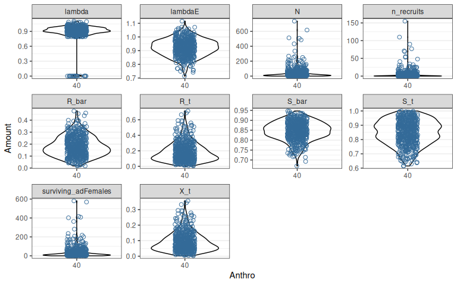
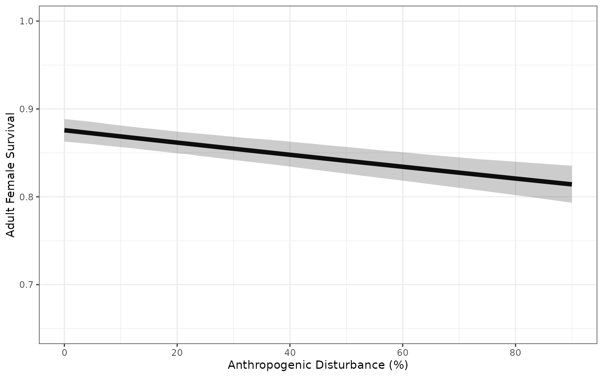
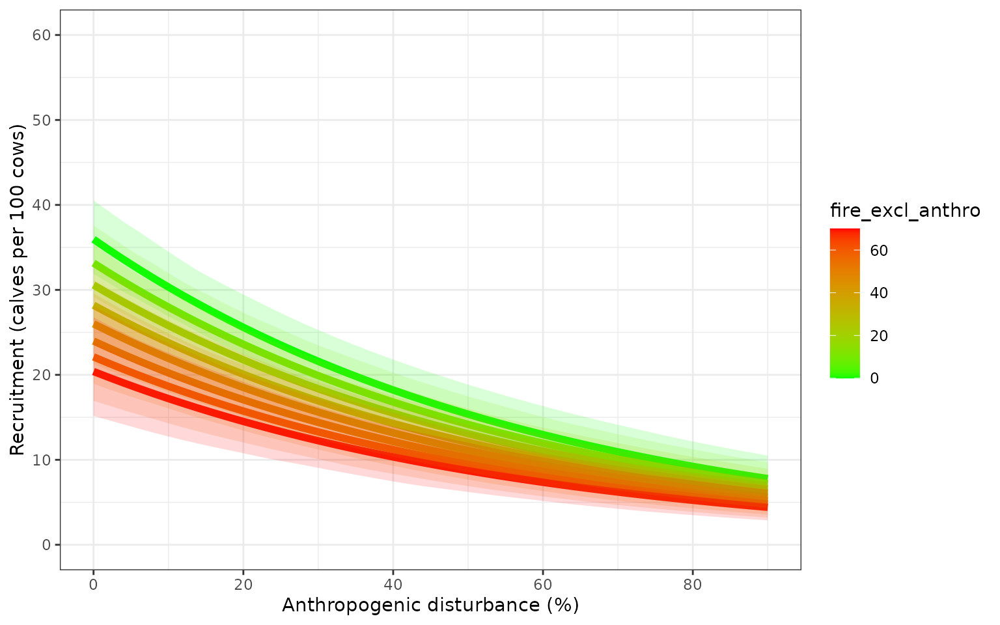
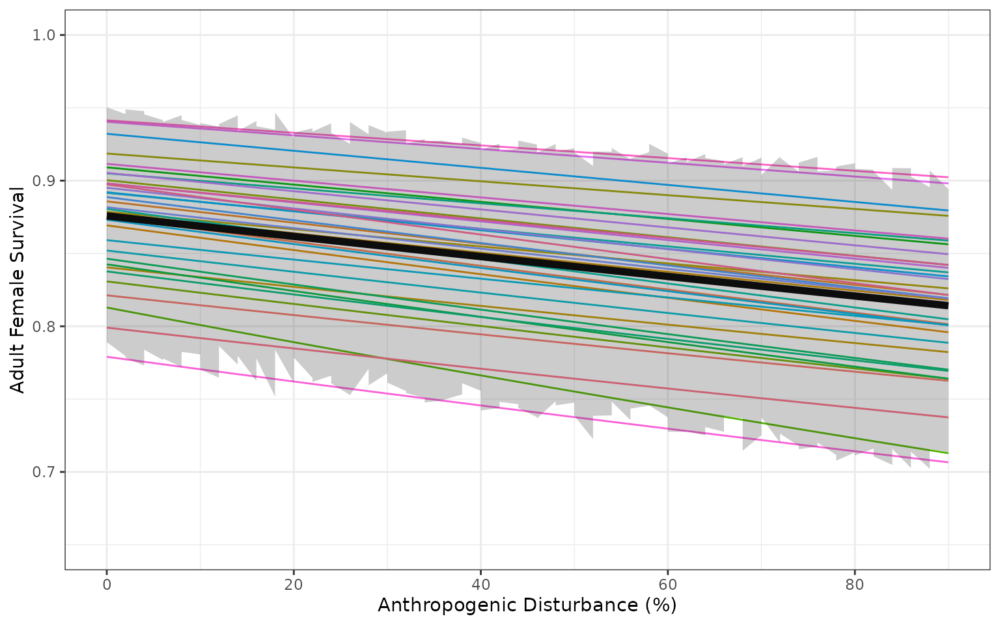
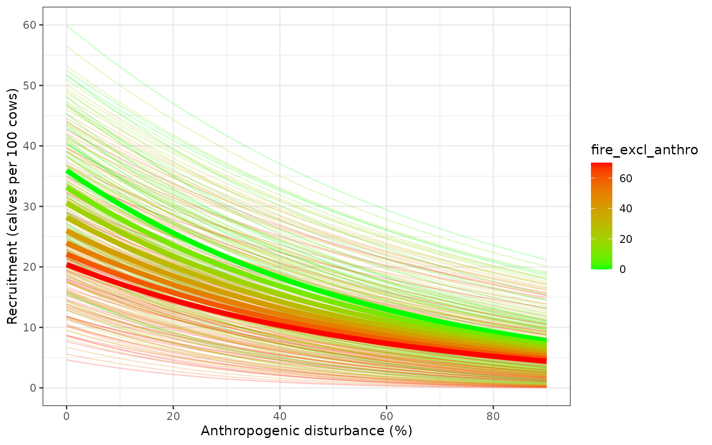
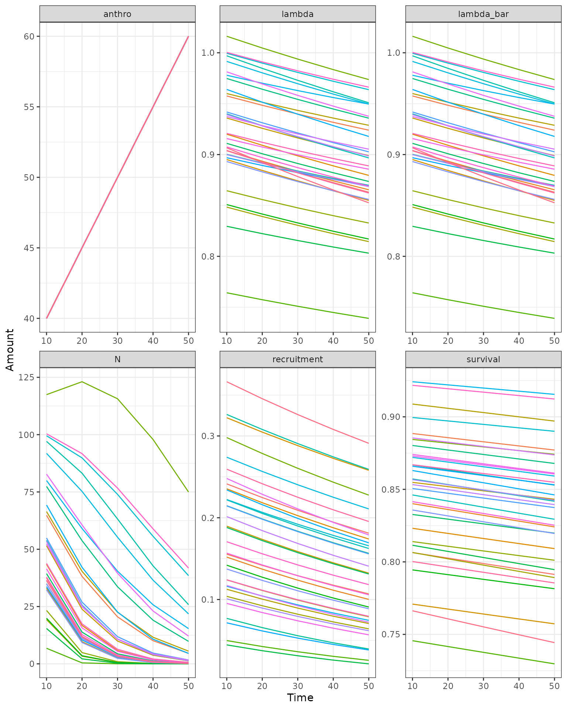
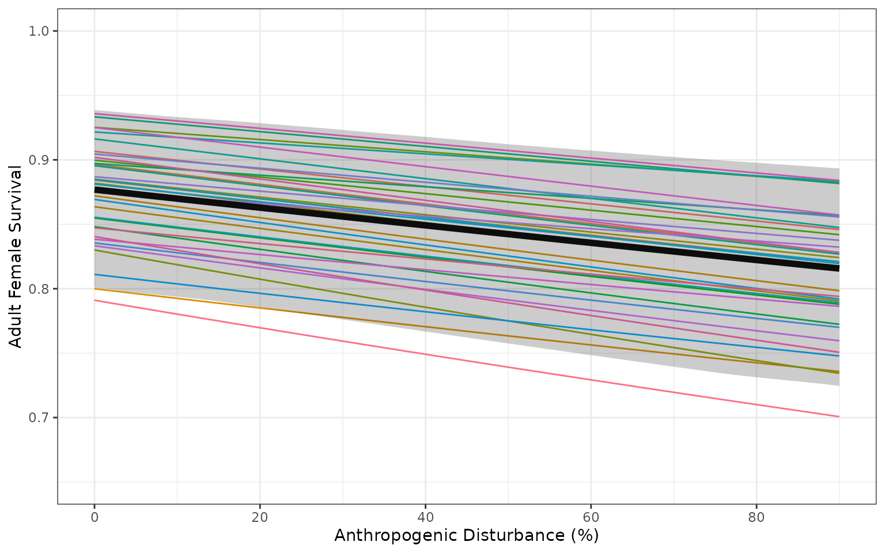
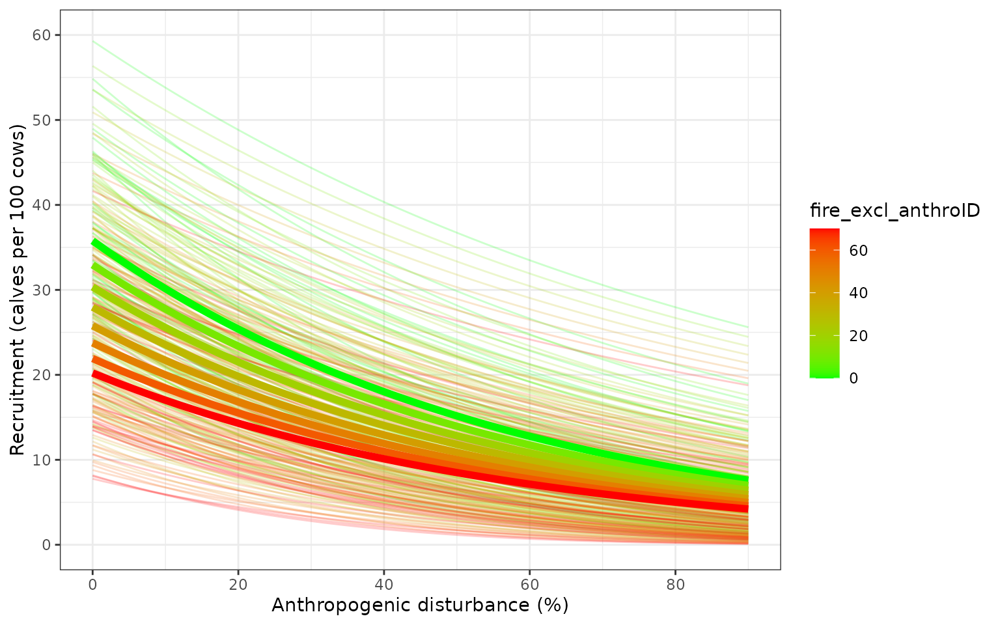
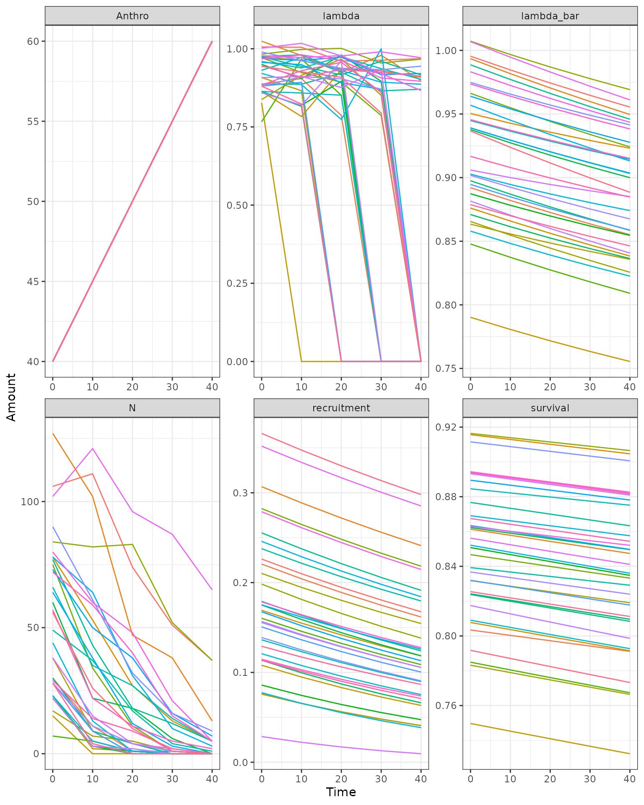

# Caribou Demography

## Introduction

Here we describe a two-stage demographic model with density dependence
and interannual variability following [Johnson et.
al. (2020)](doi:10.1111/1365-2664.13637) with modifications noted in
[Hughes et al. (2025)](https://doi.org/10.1016/j.ecoinf.2025.103095) and
[Dyson et al. (2022)](https://doi.org/10.1101/2022.06.01.494350).
Demographic rates vary with disturbance as estimated by [Johnson et.
al. (2020)](doi:10.1111/1365-2664.13637). A detailed description of the
model is provided in [Hughes et al. (2025) Section
2.4](https://doi.org/10.1016/j.ecoinf.2025.103095).

[`getNationalCoefficients()`](https://landscitech.github.io/caribouMetrics/dev/reference/getNationalCoefficients.md)
selects the regression coefficient values and standard errors for the
desired model version (see `popGrowthTableJohnsonECCC` for options) and
then samples coefficients from these Gaussian distributions for each
replicate population.

Next
[`estimateNationalRates()`](https://landscitech.github.io/caribouMetrics/dev/reference/estimateNationalRates.md)
is used to apply the sampled coefficients to the disturbance covariates
to calculate expected recruitment and survival according to the beta
regression models estimated by Johnson et al. (2020). Each population is
optionally assigned to quantiles of the Beta error distributions for
survival and recruitment. Using quantiles means that the population will
stay in these quantiles as disturbance changes over time, so there is
persistent variation in recruitment and survival among example
populations.

Finally, we can use the estimated demographic rates to project
population dynamics using a simple model with two age classes.
Interannual variation in survival and recruitment is modelled using
truncated beta distributions.

``` r
library(caribouMetrics)
library(dplyr)
library(ggplot2)
library(tidyr)
theme_set(theme_bw())
pthBase <- system.file("extdata", package = "caribouMetrics")
```

## Simple demographic projection for a single example landscape

A simple case for demographic projection is multiple stochastic
projections from a single landscape that does not change over time.
First we define a disturbance scenario with 40% anthropogenic
disturbance and 2% fire disturbance. If we had spatial data for the
disturbance in our area of interest we could use
[`disturbanceMetrics()`](https://landscitech.github.io/caribouMetrics/dev/reference/disturbanceMetrics.md)
to directly calculate the disturbance. (See [Disturbance
Metrics](https://landscitech.github.io/caribouMetrics/articles/Using_disturbanceMetrics.html)
vignette for an example).

``` r
disturbance <- data.frame(Anthro = 40, fire_excl_anthro = 2)
```

We begin by sampling coefficients for 500 replicate populations using
default Johnson et al. (2020) models “M1” and “M4”. The returned object
is a list containing the coefficients and standard errors from the
national model as well as the sampled coefficients and the quantiles
that they have been assigned to.

``` r
popGrowthPars <- getNationalCoefficients(500)

head(popGrowthPars$coefSamples_Survival$coefSamples)
#>       Intercept        Anthro Precision
#> [1,] -0.1530718 -0.0008907556  60.65168
#> [2,] -0.1399809 -0.0007155384  61.65165
#> [3,] -0.1612743 -0.0007628660  68.57570
#> [4,] -0.1420441 -0.0007747503  52.81483
#> [5,] -0.1370847 -0.0009535161  52.68192
#> [6,] -0.1329182 -0.0008050787  60.32032
head(popGrowthPars$coefSamples_Survival$coefValues)
#>    Intercept Anthro Precision
#>        <num>  <num>     <num>
#> 1:    -0.142 -8e-04  63.43724
head(popGrowthPars$coefSamples_Survival$coefStdErrs)
#>      Intercept      Anthro Precision
#>          <num>       <num>     <num>
#> 1: 0.007908163 0.000127551  8.272731
head(popGrowthPars$coefSamples_Survival$quantiles)
#> [1] 0.25345691 0.02880762 0.89123246 0.36007014 0.55806613 0.19063126
```

Next we calculate sample demographic rates given sampled model
coefficients and disturbance metrics for our example landscape, setting
`returnSample = TRUE` so that the results returned contain a row for
each sample in each scenario. We set the initial population size for
each sample population to 100, and project population dynamics for 20
years using the `caribouPopGrowth` function with default parameter
values. Anthropogenic disturbance is high on this example landscape, so
the projected population growth rate for most sample populations is
below 1, but uncertainty in the model means that a few sample
populations persist.

``` r
rateSamples <- estimateNationalRates(
  covTable = disturbance,
  popGrowthPars = popGrowthPars,
  ignorePrecision = FALSE,
  returnSample = TRUE,
  useQuantiles = FALSE)     
rateSamples$N0 <- 100
demography <- cbind(rateSamples,
                    caribouPopGrowth(N = rateSamples$N0,
                                     numSteps = 20,
                                     R_bar = rateSamples$R_bar,
                                     S_bar = rateSamples$S_bar))
```

``` r

fds <- pivot_longer(demography, !(scnID:replicate) & !N0, names_to = "Metric",
                    values_to = "Amount")
d1 <- ggplot(fds, aes(x = as.factor(round(Anthro, 2)), y = Amount, 
                      colour = fire_excl_anthro)) +
  geom_violin(alpha = 0.4, color = "black") +
  geom_point(shape = 21, size = 2, position = position_jitterdodge()) +
  facet_wrap(~Metric, scales = "free") +
  theme(legend.position = "none") +
  xlab("Anthro")

plot(d1)
```



## Effects of disturbance on demographic rates

We can project demographic rates over a range of landscape conditions to
recreate figures 3 and 5 from Johnson et al. (2020) and see the effects
of changing disturbance on model behaviour. First we create a table of
disturbance scenarios across a range of different levels of fire and
anthropogenic disturbance.

``` r
covTableSim <- expand.grid(Anthro = seq(0, 90, by = 2), 
                           fire_excl_anthro = seq(0, 70, by = 10)) 
covTableSim$Total_dist = covTableSim$Anthro + covTableSim$fire_excl_anthro
```

We again sample coefficients from default models M1 and M4. The sample
of 500 is used to calculate averages, while the sample of 35 is used to
show variability among populations.

``` r
# set seed so vignette looks the same each time
set.seed(34533)

popGrowthPars <- getNationalCoefficients(
  500,
  modelVersion = "Johnson",
  survivalModelNumber = "M1",
  recruitmentModelNumber = "M4",
  populationGrowthTable = popGrowthTableJohnsonECCC
)

popGrowthParsSmall <- getNationalCoefficients(
  35,
  modelVersion = "Johnson",
  survivalModelNumber = "M1",
  recruitmentModelNumber = "M4",
  populationGrowthTable = popGrowthTableJohnsonECCC
)
```

Next we calculate demographic rates given sampled model coefficients.
For the smaller sample we set `returnSample = TRUE` so that the results
returned contain a row for each sample in each scenario. Setting
`useQuantiles = TRUE` assigns each sample population to a quantile of
the regression model error distributions for survival and recruitment,
which allows us to see how demographic rates change. For the larger
sample we set `returnSample = FALSE` and the result has one row for each
scenario and includes summary statistics of the uncertainty across the
samples. We do this twice, once with `ignorePrecision = TRUE` and once
with `ignorePrecision = FALSE` to demonstrate the effect of considering
the variance among populations around the National mean in addition to
the uncertainty about the coefficient estimates.

``` r
rateSamples <- estimateNationalRates(
  covTable = covTableSim,
  popGrowthPars = popGrowthParsSmall,
  ignorePrecision = FALSE,
  returnSample = TRUE,
  useQuantiles = TRUE
)

rateSummaries <- estimateNationalRates(
  covTable = covTableSim,
  popGrowthPars = popGrowthPars,
  ignorePrecision = FALSE,
  returnSample = FALSE,
  useQuantiles = FALSE
)

rateSummariesIgnorePrecision <- estimateNationalRates(
  covTable = covTableSim,
  popGrowthPars = popGrowthPars,
  ignorePrecision = TRUE,
  returnSample = FALSE,
  useQuantiles = FALSE
)
```

### Parameter uncertainty

Variation in demographic rates from model that includes uncertainty
about the regression coefficients, and does not include additional
variation captured by the precision parameter of the Beta regression
model [Ferrari and Cribari-Neto
2004](https://doi.org/10.1080/0266476042000214501). The bands are the
2.5% and 97.5% quantiles of 500 sample parameter values.


### Parameter uncertainty and precision

Variation in demographic rates from model that includes uncertainty
about the regression coefficients and additional variation captured by
the precision parameter of the Beta regression model [Ferrari and
Cribari-Neto 2004](https://doi.org/10.1080/0266476042000214501). Faint
coloured lines show example trajectories of expected demographic rates
in sample populations, assuming each sample population is randomly
distributed among quantiles of the beta distribution, and each
population remains in the same quantile of the beta distribution as
disturbance changes.


## Projection of population growth over time on a changing landscape

In this example, we project 35 sample populations for 50 years on a
landscape where the anthropogenic disturbance footprint is increasing by
5% per decade. We set `interannualVar = FALSE`, `K = FALSE`, and
`probOption = "continuous"` to use a simpler model without interannual
variability, density dependence, or discrete numbers of animals, as in
[Stewart et al. 2023](https://doi.org/10.1002/eap.2816).

``` r
numTimesteps <- 5
stepLength <- 10
N0 <- 100
AnthroChange <- 5 #For illustration assume 5% increase in anthropogenic disturbance footprint each decade

# at each time,  sample demographic rates and project, save results
pars <- data.frame(N0 = N0)
for (t in 1:numTimesteps) {
  covariates <- disturbance
  covariates$Anthro <- covariates$Anthro + AnthroChange * (t - 1)

  rateSamples <- estimateNationalRates(
    covTable = covariates,
    popGrowthPars = popGrowthParsSmall,
    ignorePrecision = FALSE,
    returnSample = TRUE,
    useQuantiles = TRUE
  )
  if (is.element("N", names(pars))) {
    pars <- subset(pars, select = c(replicate, N))
    names(pars)[names(pars) == "N"] <- "N0"
  }
  pars <- merge(pars, rateSamples)
  pars <- cbind(pars, 
                caribouPopGrowth(pars$N0,
                                 R_bar = pars$R_bar, S_bar = pars$S_bar,
                                 numSteps = stepLength, interannualVar = FALSE, 
                                 K = FALSE, probOption = "continuous"))

  # add results to output set
  fds <- subset(pars, select = c(replicate, Anthro, S_bar, R_bar, N, lambda, lambdaE))
  fds$replicate <- as.numeric(gsub("V", "", fds$replicate))
  names(fds) <- c("Replicate", "anthro", "survival", "recruitment", "N", "lambda", "lambda_bar")
  fds <- pivot_longer(fds, !Replicate, names_to = "MetricTypeID", values_to = "Amount")
  fds$Timestep <- t * stepLength
  if (t == 1) {
    popMetrics <- fds
  } else {
    popMetrics <- rbind(popMetrics, fds)
  }
}

popMetrics$MetricTypeID <- as.character(popMetrics$MetricTypeID)
popMetrics$Replicate <- paste0("x", popMetrics$Replicate)
# popMetrics <- subset(popMetrics, !MetricTypeID == "N")
```

TODO: explain difference between lambda in this graph and in the one
from `trajectoriesFromNational`



## Using wrapper functions

The examples above show how to produce trajectories using the individual
functions, but the package also contains a wrapper function to do all of
these steps in one. `trajectoriesFromNational` samples the coefficients
from the National model, calculates demographic rates given those
coefficients and the level of disturbance and projects the population’s
growth using `caribouPopGrowth` for one time step. If the disturbance
scenario includes a Year column `trajectoriesFromNational` does the same
process but will project population growth over time and can return the
samples.

``` r
natTraj <- trajectoriesFromNational(replicates = 500, 
                                    disturbance = covTableSim, interannualVar = FALSE, 
                                    useQuantiles = TRUE)

# add year to return samples
natTraj35 <- trajectoriesFromNational(replicates = 35, 
                                    disturbance = covTableSim %>% 
                                      mutate(Year = Anthro+100*fire_excl_anthro), 
                                    returnSamples = TRUE, interannualVar = FALSE, 
                                    useQuantiles = TRUE)
```



Using the same scenario with anthropogenic disturbance footprint
increasing by 5% per decade, we can also produce projections over a
changing landscape with `trajectoriesFromNational`.

``` r
disturbance2 = data.frame(step = 0:4) %>% bind_cols(disturbance) %>% 
  mutate(Anthro = Anthro + AnthroChange * step, 
         Year = step * 10)

# set seed so vignette looks the same each time
set.seed(54545)

popMetrics2 <- trajectoriesFromNational(disturbance = disturbance2, replicates = 35, 
                                        interannualVar = FALSE, useQuantiles = TRUE,
                                        N0 = 100, numSteps = 10)

popMetrics2 <- popMetrics2$samples %>% 
  filter(MetricTypeID %in% c("Anthro", "N", "recruitment","survival", "lambda_bar", "lambda"))
```



## References

Dyson, M., Endicott, S., Simpkins, C., Turner, J. W., Avery-Gomm, S.,
Johnson, C. A., Leblond, M., Neilson, E. W., Rempel, R., Wiebe, P. A.,
Baltzer, J. L., Stewart, F. E. C., & Hughes, J. (2022). Existing caribou
habitat and demographic models need improvement for Ring of Fire impact
assessment: A roadmap for improving the usefulness, transparency, and
availability of models for conservation.
<https://doi.org/10.1101/2022.06.01.494350>

Ferrari S, Cribari-Neto F (2004) Beta Regression for Modelling Rates and
Proportions. Journal of Applied Statistics 31:799–815.
<https://doi.org/10.1080/0266476042000214501>

Hughes, J., Endicott, S., Calvert, A.M. and Johnson, C.A., 2025.
Integration of national demographic-disturbance relationships and local
data can improve caribou population viability projections and inform
monitoring decisions. Ecological Informatics, 87, p.103095.
<https://doi.org/10.1016/j.ecoinf.2025.103095>

Johnson, C.A., Sutherland, G.D., Neave, E., Leblond, M., Kirby, P.,
Superbie, C. and McLoughlin, P.D., 2020. Science to inform policy:
linking population dynamics to habitat for a threatened species in
Canada. Journal of Applied Ecology, 57(7), pp.1314-1327.
<https://doi.org/10.1111/1365-2664.13637>

Novomestky F, Nadarajah S (2016) Package ‘truncdist.’ Version 1.0-2URL
<https://CRAN.R-project.org/package=truncdist>

Stewart, F.E., Micheletti, T., Cumming, S.G., Barros, C., Chubaty, A.M.,
Dookie, A.L., Duclos, I., Eddy, I., Haché, S., Hodson, J. and Hughes,
J., 2023. Climate‐informed forecasts reveal dramatic local habitat
shifts and population uncertainty for northern boreal caribou.
Ecological Applications 33:e2816.  
<https://doi.org/10.1002/eap.2816>
