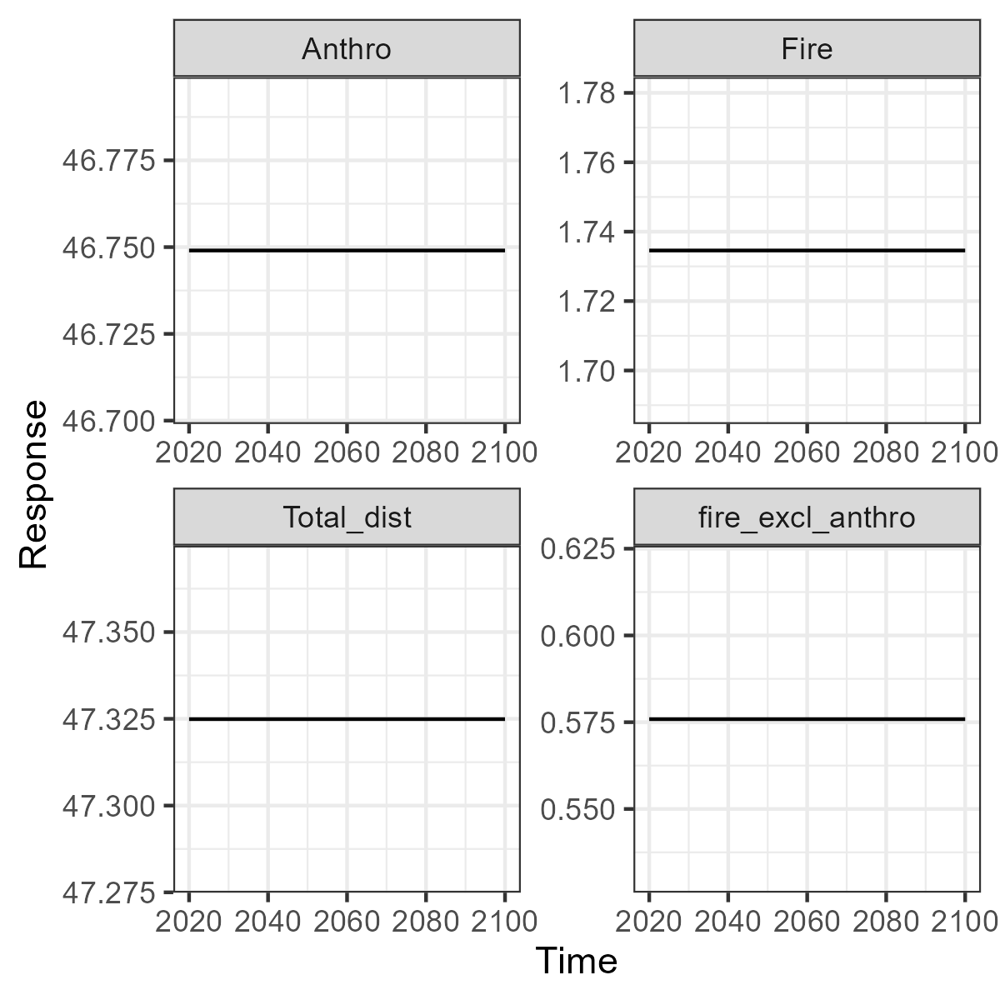
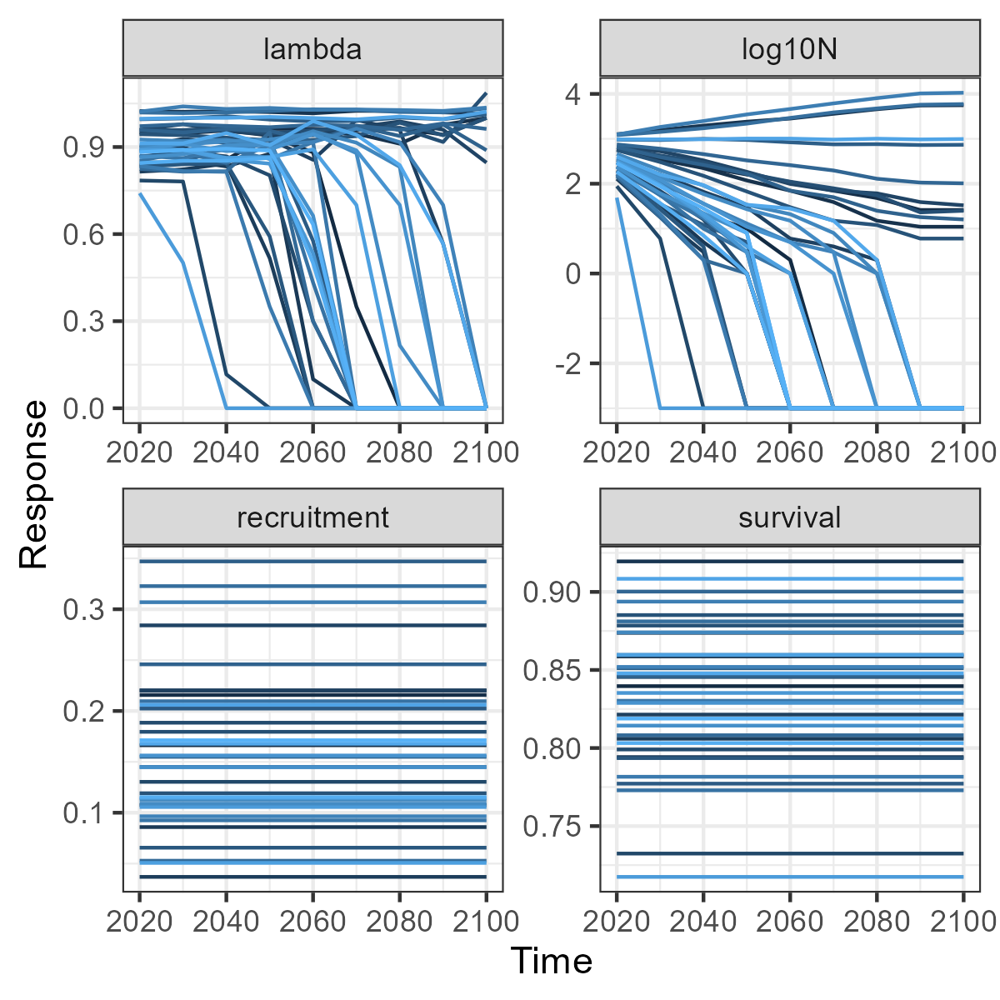

```{r, include = FALSE}
knitr::opts_chunk$set(
  collapse = TRUE,
  eval = FALSE,
  comment = "#>"
)
```

## Introduction

This vignette is directed at users of the SyncroSim user interface for integrating SpaDES, LandR and FireSense projections with caribou habitat and demographic models in the [`caribouMetrics`](https://landscitech.github.io/caribouMetrics/) package. For new users we recommend starting with our video tutorial [presentation.](https://docs.google.com/presentation/d/1CwnPpIjPI0P6wG2t2LW_f3NEBOhqSWT7/edit?usp=sharing&ouid=113424671555606837963&rtpof=true&sd=true)  There are vignettes available for the [caribou habitat](https://landscitech.github.io/caribouMetrics/articles/Using_caribouHabitat.html) and [demographic](https://landscitech.github.io/caribouMetrics/articles/caribouDemography.html) models that give details on how the models work and how to run them in R. To fully understand these models please refer to the journal articles where they were published: [Hornseth and Rempel (2016)](https://doi.org/10.1139/cjz-2015-0101) [Johnson et. al. (2020)](https://besjournals.onlinelibrary.wiley.com/doi/full/10.1111/1365-2664.13637)].

Below we explain how to install and setup the user interface, provide links between the options exposed in the UI and the `caribouMetrics` function documentation and demonstrate how to set up a SynscroSim library and extract scenario results for plotting in R using rsyncrosim. 

## Installation
To run the UI, installation of several software programs and packages is required. You will need to install [R, RStudio (recommended)](https://www.rstudio.com/products/rstudio/download/#download), [SyncroSim](https://syncrosim.com/download/), [ROFSim SyncroSim Package](https://github.com/LandSciTech/ROFSim/releases) ([instructions](http://docs.syncrosim.com/how_to_guides/package_manager.html#2-installing-from-a-package-file)), caribouMetrics R package and rsyncrosim R package. The script below can be copied into the R console to install the caribouMetics and rsyncrosim packages and to check that the other required software is available. Use the links above to install the other software dependencies before running this script. 

```{r, eval=FALSE}
if(!requireNamespace("drat", quietly = TRUE)){
  install.packages("drat")
}

drat::addRepo("LandSciTech")

install.packages("pfocal", type = "binary")

if(!requireNamespace("pfocal", quietly = TRUE)){
  stop("The pfocal package has not been successfully installed.\n",
       "Re-run the code above and carefully read any error messages.")
}

install.packages("caribouMetrics", type = "binary")

if(!requireNamespace("caribouMetrics", quietly = TRUE)){
  stop("The caribouMetrics package has not been successfully installed.\n",
       "Re-run the code above and carefully read any error messages.")
}


# install rsyncrosim
install.packages("rsyncrosim")

if(!requireNamespace("rsyncrosim", quietly = TRUE)){
    stop("The rsyncrosim package has not been successfully installed.\n",
       "Re-run the code above and carefully read any error messages.")
}

# Check for Syncrosim and ROFSim package
if(!"ROFSim" %in% rsyncrosim::package()$name){
  stop("The ROFSim SyncroSim package must be installed.\n",
       "Follow instructions at:\n http://docs.syncrosim.com/how_to_guides/package_manager.html#2-installing-from-a-package-file\n", 
       "to install the package from a file. \nThe file can be downloaded from:\n",
       "https://github.com/LandSciTech/ROFSim/releases")
}

# Install ROFSim package dependencies
install.packages(c("RColorBrewer", "readr", "qs", "magrittr", "SpaDES.core", 
                   "SpaDES.tools", "gbm", "ggplot2"))

```


## Documentation for model options
By right clicking a scenario you can access the scenario properties. The Caribou Metrics tab has options that can be set for the models. The table below shows the option from the UI, the corresponding argument name in `caribouMetrics`, and the names of the function(s) in `caribouMetrics` that use that argument. Clicking the function name will take you to the documentation for that function. You can read the description at the top of the page to learn what the function does and then find the argument name to read its definition. 

UI option|caribouMetrics argument|Function|Notes|
|------------------------|-------------------|------------------|----------------|
|**Tab: Caribou Range** 
|Caribou Range Name and Coeff Range Name |caribouRange |`caribouHabitat()`|
|Caribou Range Name|projectPoly |`caribouHabitat()` and `disturbanceMetrics()`|
|**Tab:Caribou Model Options**
|ECCC Buffer Width |bufferWidth |`disturbanceMetrics()`|
|Project Polygon Padding|padProjPoly|`caribouHabitat()`|
|Focal Padding |padFocal |`caribouHabitat()` and `disturbanceMetrics()`|
|Number of Demographic Trajectories |replicates|`demographicCoefficients()`|
|Demographic Model Version |modelVersion |`demographicCoefficients()` |
|Survival Model Number|survivalModelNumber |`demographicCoefficients()` |
|Recruitment Model Number|recruitmentModelNumber |`demographicCoefficients()` |
|Initial Population Size |N |`caribouPopGrowth()` |
|P_0: Maximum recruitment multiplier|P_0 |`caribouPopGrowth()` |
|P_K: Recruitment multiplier at carrying capacity|P_K |`caribouPopGrowth()` |
|a: Density dependence shape parameter|a |`caribouPopGrowth()` |
|b: Allee effect parameter|b |`caribouPopGrowth()` |
|K: Carrying capacity multiplier|K |`caribouPopGrowth()` |
|r_max: Maximum population growth rate|r_max |`caribouPopGrowth()` |
|s: Sex ratio|s |`caribouPopGrowth()` |
|l_R: Minimum recruitment|l_R |`caribouPopGrowth()` |
|h_R: Maximum recruitment|h_R |`caribouPopGrowth()` |
|l_S: Minimum survival|l_S |`caribouPopGrowth()` |
|h_S: Maximum survival|h_S |`caribouPopGrowth()` |
|Interannual Variation|interannualVar |`caribouPopGrowth()` |
|probOption|probOption |`caribouPopGrowth()` |
|**Tab: Raster Data**
|Harvest| anthroDist |`caribouHabitat()` |
| Anthropogenic Disturbance| anthroDist |`caribouHabitat()` |
| Natural Disturbances| natDist |`caribouHabitat()` |
| Provincial Land Cover| landCover |`caribouHabitat()` |
|**Tab: Polygon Data**
|Ranges|projectPoly|`caribouHabitat()` and `disturbanceMetrics()`|This .shp file can include multiple range polygons and the ones to use will be selected based on the Caribou Range Name provided|
|Eskers|esker|`cariouHabitat()`|
|Linear Features|linFeat|`cariouHabitat()`|

## Set up a new SyncroSim Library
Here we demonstrate how to set up a SyncroSim Library for the ROFSim Package using the rsyncrosim package. For more details on the rsyncrosim package and its funcitons see the Introduction to rsyncrosim [vignette](https://syncrosim.github.io/rsyncrosim/articles/a01_rsyncrosim_vignette_basic.html)

In this example we will create the new library inside the `caribouMetrics` package directory in order to take advantage of the example data sets installed there. First we create a library called "demoSSimLib" and then a project called "Demo".

```{r prep_lib_1}
library(rsyncrosim)

# Install ROFSim package using file path to ssimpkg file
# addPackage("path/to/ROFSim.ssimpkg")

rootPth <- system.file("extdata", package = "caribouMetrics")

cDir <- file.path(rootPth, "demoSSimLib")

dir.create(cDir)

libName <-  "demoSSimLib"

cLib <- ssimLibrary(paste0(cDir, "/", libName), package = "ROFSim", overwrite = TRUE)

cProj <- project(cLib, "Demo")

```

Next, we ensure that SyncroSim uses the same R version as is used to run this vignette. This is only necessary if you have multiple R versions installed. 

```{r prep_lib_2}
# Make sure the library uses the correct R installation
rConfig <- datasheet(cLib, name = "core_RConfig")
rConfig <- addRow(rConfig, c(ExePath = list.files(R.home("bin"), "Rscript", full.names = TRUE)))
saveDatasheet(cLib, rConfig, name = "core_RConfig")
```

Now we will set up the data sheets used at the project level and the run control scenario. To determine the names of the sheets in the project look at `cProjDS`. You can determine what column names and variable types are expected for a sheet with for example `str(datasheet(cProj, "ROFSim_CaribouRange"))`.
```{r prep_proj}
# inspect datasheets used at the project level
cProjDS <- datasheet(cProj)

# set available options for input data
cSheet <- "ROFSim_CaribouRange"
cc <- data.frame(Name = c("James Bay", "Missisa", "Ozhiski", "Nipigon",
                          "Pagwachuan"))
saveDatasheet(cProj, cc, name = cSheet)

cSheet <- "ROFSim_Rasters"
  cc <- data.frame(
    Name = c("Caribou Ranges", "Harvest", "Anthropogenic Disturbance",
             "Natural Disturbances", "Provincial Land Cover", 
             "Linear Features", "Eskers", 
             "Eskers400", "Roads")
  )
saveDatasheet(cProj, cc, name = cSheet)

# scenarios - run control
rcScn <- scenario(cProj, "Run Control 2020 - 2100")
cSheet <- "ROFSim_RunControl"
cc <- data.frame(MinimumIteration = 1, MaximumIteration = 1,
                 MinimumTimestep = 2020, MaximumTimestep = 2100, OutputFrequency = 10)
saveDatasheet(rcScn, cc, name = cSheet)

```
Next we set up a scenario to process the data making sure that it is all aligned and ready for modelling. 
```{r data-scenario}
datScn <- scenario(cProj, "data prep")

cSheet <- "core_Pipeline"
cc <- data.frame(StageNameID = "Prepare Spatial Data", RunOrder = 1)
saveDatasheet(datScn, cc, name = cSheet)

cSheet <- "ROFSim_RasterFile"
cc <- data.frame(RastersID = "Natural Disturbance", 
                 Filename = file.path(rootPth, "natDist.tif"))
cc <- rbind(cc, data.frame(RastersID = "Harvest", 
                           Filename = file.path(rootPth, "anthroDist.tif")))
cc <- rbind(cc, data.frame(RastersID = "Provincial Land Cover", 
                           Filename = file.path(rootPth, "landCover.tif")))
saveDatasheet(datScn, cc, name = cSheet, append = FALSE)

cSheet <- "ROFSim_ExternalFile"
cc <- data.frame(PolygonsID = "Eskers", File = file.path(rootPth, "esker.shp"))
cc <- rbind(cc, data.frame(PolygonsID = "Linear Features", 
                           File = file.path(rootPth, "rail.shp")))
cc <- rbind(cc, data.frame(PolygonsID = "Linear Features",
                           File = file.path(rootPth, "utilities.shp")))
cc <- rbind(cc, data.frame(PolygonsID = "Ranges", 
                           File = file.path(rootPth, "projectPoly.shp")))
cc <- rbind(cc, data.frame(PolygonsID = "Study Area", 
                           File = file.path(rootPth, "projectPoly.shp")))
cc <- rbind(cc, data.frame(PolygonsID = "Linear Features", 
                           File = file.path(rootPth, "roads.shp")))
saveDatasheet(datScn, cc, name = cSheet, append = FALSE)

datRes <- run(datScn)
```


Finally, we set up a scenario by setting options for the models and telling SyncroSim where to find the input files. This scenario inherits the options from the run control scenario created above. We can run the scenario from R or open the SyncroSim library to see the user interface and run it from there.

```{r prep-scenario}
# scenario - caribou - current
cbScn <- scenario(cProj, "Caribou - 2020-2100")

cSheet <- "core_Pipeline"
cc <- data.frame(StageNameID = "Caribou Habitat", RunOrder = 1)
saveDatasheet(cbScn, cc, name = cSheet)

cSheet <- "ROFSim_RunCaribouRange"
cc <- data.frame(Range = "Nipigon", CoeffRange = "Nipigon")
saveDatasheet(cbScn, cc, name = cSheet)

cSheet <- "ROFSim_CaribouDataSource"
cc <- data.frame(LandCoverRasterID = "Provincial Land Cover", 
                 ProjectShapeFileID = "Ranges",
                 EskerRasterID = "Eskers400",
                 LinearFeatureRasterID = "Linear Features",
                 LinearFeatureShapeFileID = "Linear Features",
                 NaturalDisturbanceRasterID = "Natural Disturbance", 
                 HarvestRasterID = "Harvest", 
                 AnthropogenicRasterID = "Anthropogenic Disturbance")
saveDatasheet(cbScn, cc, name = cSheet)

cSheet <- "ROFSim_CaribouModelOptions"
cc <- data.frame(RunDistMetrics = TRUE, RunCaribouHabitat = TRUE, 
                 RunDemographicModel = TRUE, padProjPoly = TRUE)
saveDatasheet(cbScn, cc, name = cSheet)


dependency(cbScn, rcScn)
dependency(cbScn, datRes)

# run the scenario
cbRes <- run(cbScn)

# Open the library in the SyncroSim UI
# shell.exec(filepath(cLib))

```


## Explore model results in R
Once the scenario has run we can look at the results using the user interface or we can extract the results from the UI and create flexible custom plots in R. Here we extract the disturbance metrics to plot change over time (in our example there is no change) and extract the change in population metrics to see the variation among the 35 replicate populations. 

```{r plt_res}
library(ggplot2)
theme_set(theme_bw())

# Get list of all results scenarios
allRes <- scenario(cLib, results = TRUE)

# get results scnID for the most recent result
exampleScn <- max(subset(allRes, grepl(paste0( "Caribou - 2020-2100 \\("),
                                       allRes$name))$scenarioId)

# Load result tables
rScn <- scenario(cLib, exampleScn)

#Load result tables
distMetrics <- datasheet(rScn, "OutputDisturbanceMetrics")
popMetrics <- datasheet(rScn, "OutputPopulationMetrics")

#See changes in disturbance metrics over time
base1 <- ggplot(data = distMetrics, 
                aes(x = Timestep, y = Amount))+
  geom_line(size = 0.5)+
  facet_wrap(~MetricTypeDistID,scales="free")+
  xlab("Time")+
  ylab("Response")+
  theme(legend.position = "none")
base1

popMetrics$MetricTypeDemogID <- as.character(popMetrics$MetricTypeDemogID)
popMetrics$Amount[popMetrics$MetricTypeDemogID == "N"] <-
  log10(popMetrics$Amount[popMetrics$MetricTypeDemogID == "N"] + 0.001)
popMetrics$MetricTypeDemogID[popMetrics$MetricTypeDemogID == "N"] <- "log10N"

#See changes in demographic metrics over time
base2 <- ggplot(data = popMetrics, 
                aes(x = Timestep, y = Amount, group = Replicate, 
                    colour = Replicate))+
  geom_line(size = 0.5)+
  facet_wrap(~MetricTypeDemogID, scales = "free")+
  xlab("Time")+
  ylab("Response")+
  theme(legend.position = "none")
base2
```
{width=50%}
{width=50%}

Finally delete the library to tidy up.

```{r clean-up}
delete(paste0(cDir,"/",libName,".ssim"), force = TRUE)
```
## Overview of ROFSim package structure and components
The ROFSim SyncroSim package that enables this workflow consists of an [xml file](https://github.com/LandSciTech/ROFSim/blob/main/package.xml) that defines model inputs, outputs, and the UI design, and four transformers (pipeline stages) written in R:

1.	[Spades Import](https://github.com/LandSciTech/ROFSim/blob/main/load_spades_outputs.R) Given SpaDES outputs ([example here](https://drive.google.com/drive/folders/1kjjQRyvTHUTfPBsTgzmfk3oV8uBu8Asy?usp=sharing)), this transformer can extract any component of the outputs table. Our example library is currently configured to extract standAgeMap.

2.	[Generate LCC from Cohort Data](https://github.com/LandSciTech/ROFSim/blob/main/makeLccFromCohortData.R) Given SpaDES outputs, this transformer returns projected Ontario Far North Landcover maps, and maps of forest type (conifer, deciduous or mixed). 

3.	[Prepare Spatial Data](https://github.com/LandSciTech/LandSciTech/blob/main/prepare_spatial_data.R) Given a Land Cover raster, a Study Area polygon, and other spatial inputs, this transformer aligns all the spatial inputs. This is a wrapper around the `loadSpatialInputs()` function from the `caribouMetrics` package.  

4.	[Caribou Habitat](https://github.com/LandSciTech/LandSciTech/blob/main/run_caribou_model.R) Given maps of Ranges, Study Area, Linear Features, Land Cover, Natural Disturbances, Harvest and Eskers that have been processed by the Prepare Spatial Data transformer, this transformer calculates results from the available caribou resource selection and demographic models. Functions from the `caribouMetrics` package are used to calculate habitat selection and project demography as described above.

